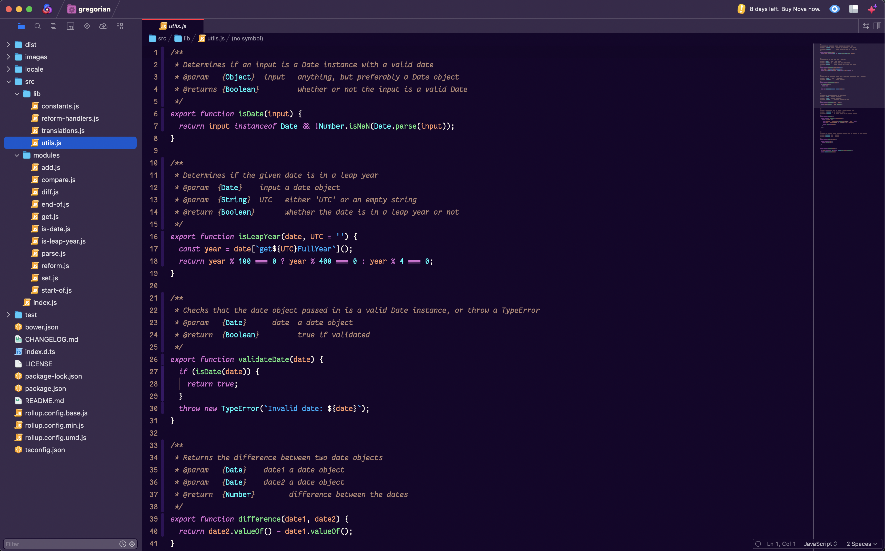

# Orchid

**Orchid** aims to be a theme you can look at all day. It's contrasty, it's fun, it uses syntax grammars to their fullest (mostly JS and TS since that's what I spend the most time looking at).

## Acknowledgements

This is based on prior work for [Sublime Text](https://github.com/patrickfatrick/orchid-theme-sublime) and, before that, [VS Code](https://github.com/patrickfatrick/orchid-vscode-colorizer).
